# Audi Showroom Web Application

## 🚗 Project Overview
A modern and interactive web application for Audi Showroom, built with React, TypeScript, and Vite, providing a seamless and professional user experience.

## ✨ Key Features

### 1. Dynamic Home Page
- Dynamic banner showcase with highlighted Audi car models
- Detailed feature display for each car line
- Interactive interface with smooth slide transition effects

### 2. User Authentication
- Login/Register with multiple methods:
  - Manual login
  - Google Sign-In
  - Facebook Sign-In
  - GitHub Sign-In
- Secure user authentication with JWT
- User role-based access (Admin, Regular Users)

### 3. Admin Dashboard
- Statistical dashboard
- User management
- Product management
- Order management
- Responsive and user-friendly interface

### 4. Product Page
- Car list display with filtering
- In-depth product details
- Online customization and quotation
- High-quality images

### 5. Personal Page (MyAudi)
- Personal information management
- Manage your vehicles
- Test drive scheduling
- Favorite cars list

### 6. Map Integration
- Display Audi dealerships
- Routing and navigation

## 🛠 Technologies Used
- React 19
- TypeScript
- Vite
- React Router
- Firebase Authentication
- Ant Design
- Leaflet Maps
- Axios

## 🚀 Installation & Running the Project

```bash
# Install dependencies
yarn 

# Run application in development mode
yarn dev

# Build application for production
yarn build
```

## 🔒 Security
- JWT authentication
- Route protection with role-based access
- Client and server-side validation

## 📱 Responsive Design
The application is designed to work smoothly on all devices:
- Desktop
- Tablet
- Mobile

## 🎨 Interface
Designed in Audi's style:
- Accurate color palette
- Professional typography
- Smooth animations

## 🔜 Development Roadmap
- Add dark/light mode
- Performance optimization
- Multi-language support


## 📸 Demo
### 🏠 Home
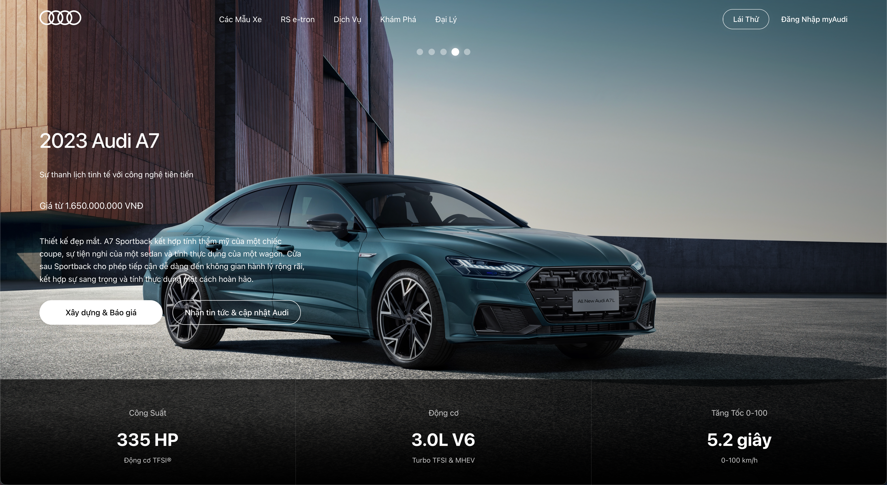
### 🛞 Model
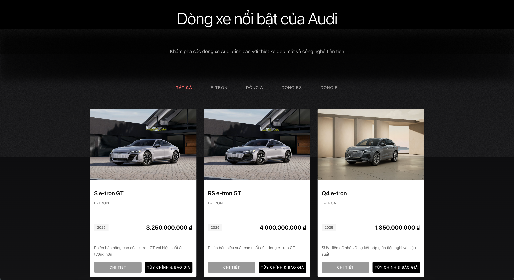
### ✅ All model
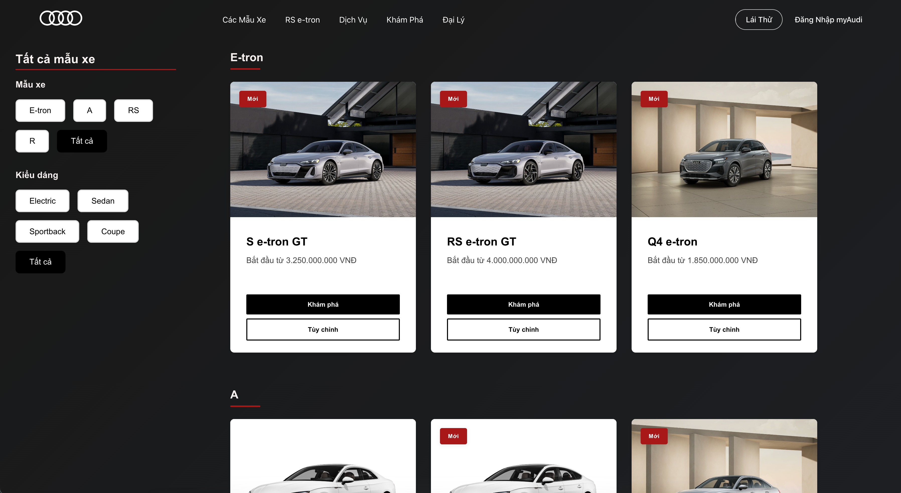
### 🚘 Details vehicle
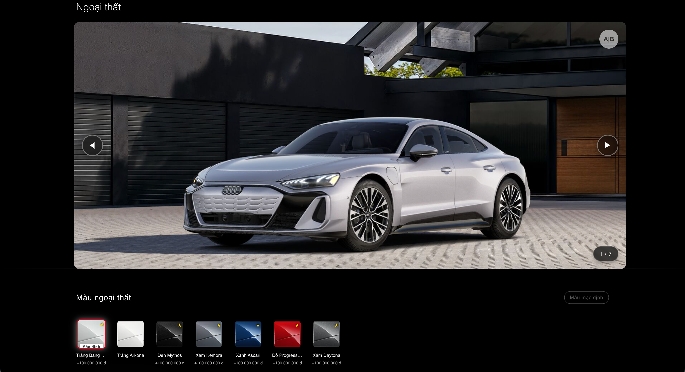
### 🚗 Color vehicle
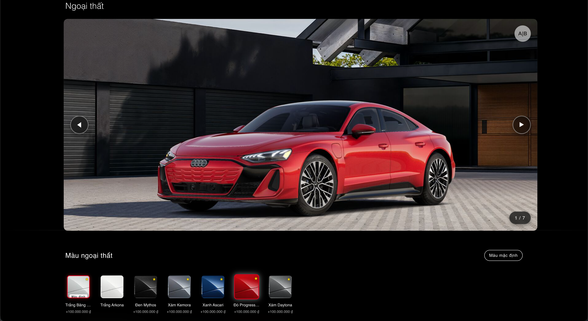
### 🌈 Compare vehicle
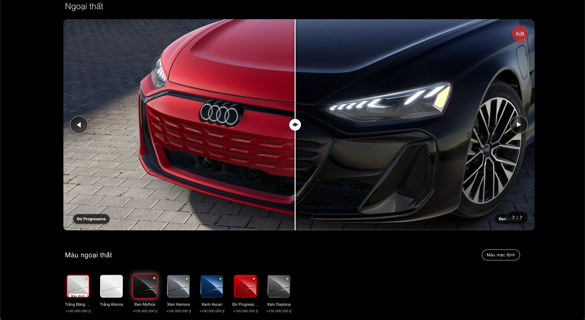
### 🛠️ Interior
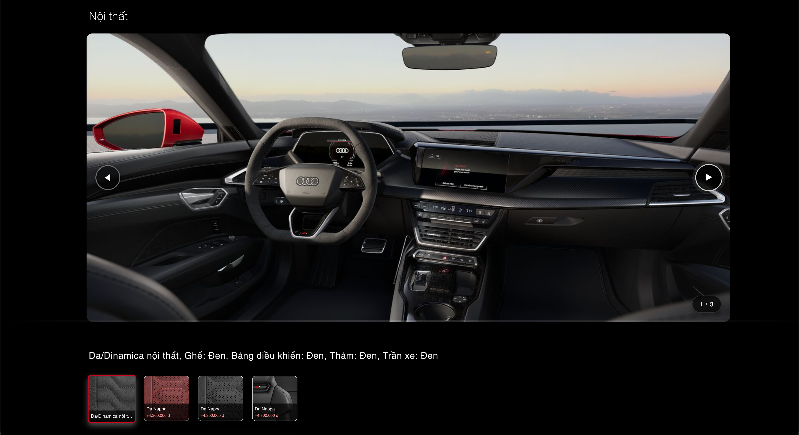
### 🪐 Interior color
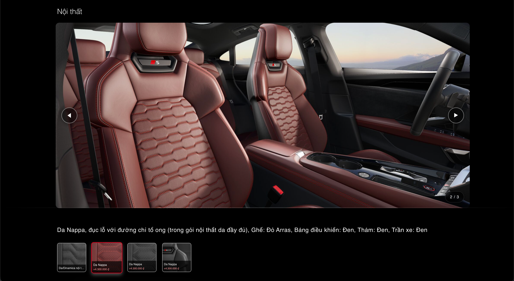
### 🗺️ Map
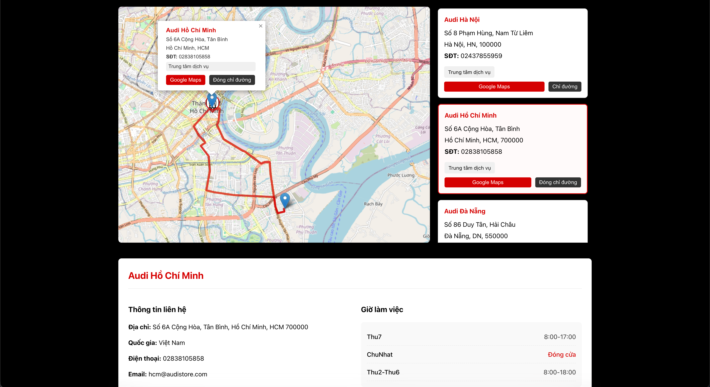
### 🔐 Login page
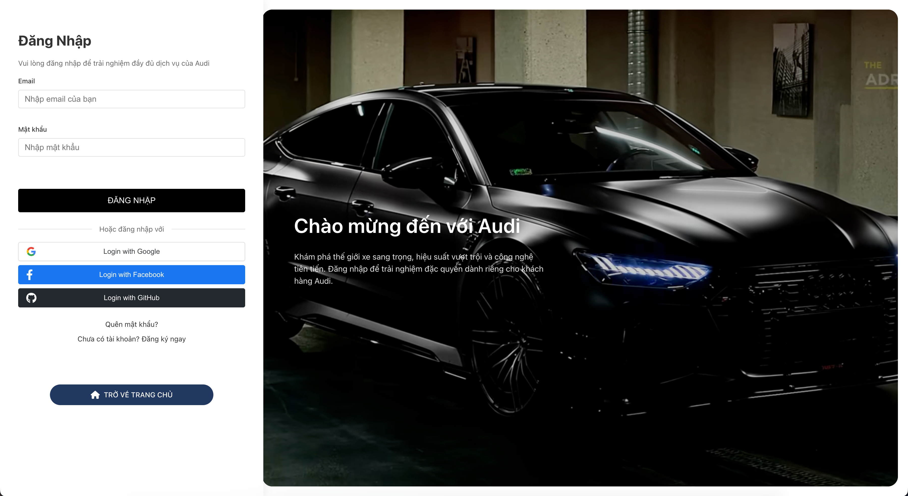
### 📩 Forgot password OTP to email
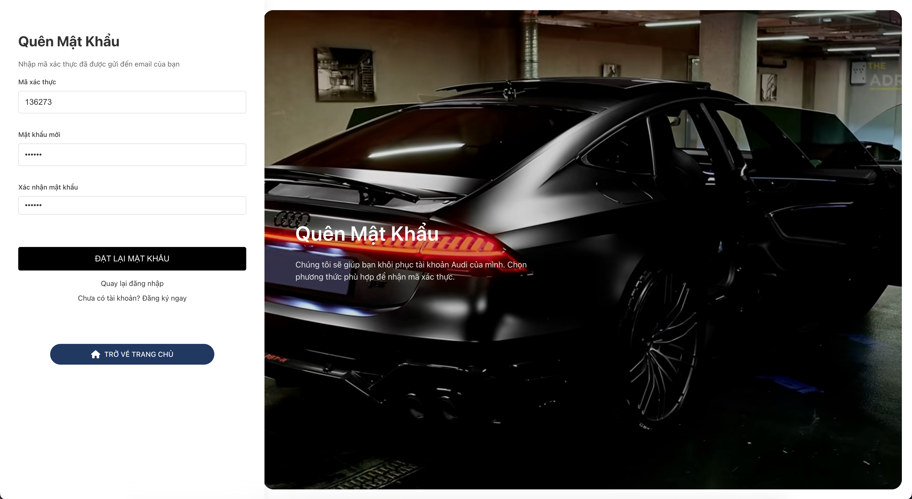
### 🌝 Light mode
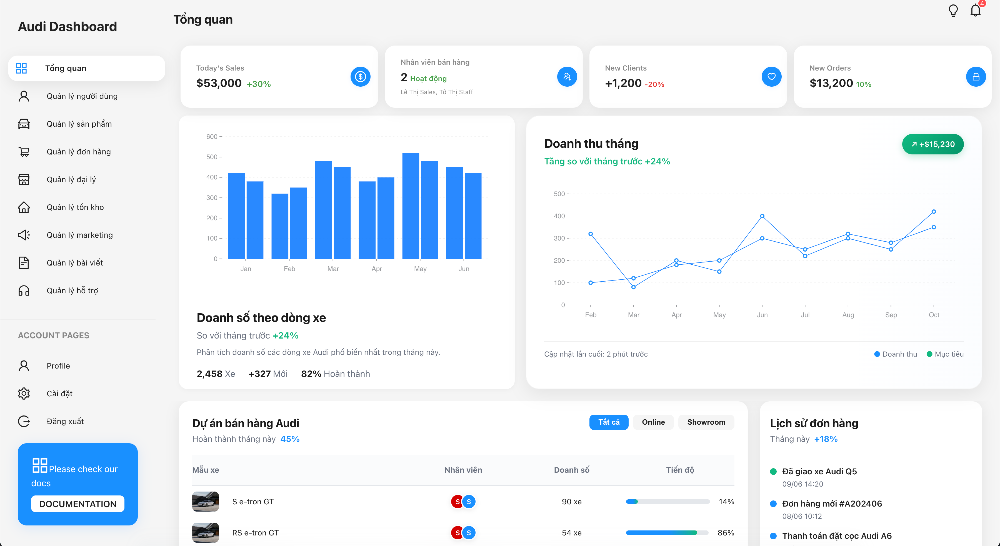
### 🌚 Dark mode
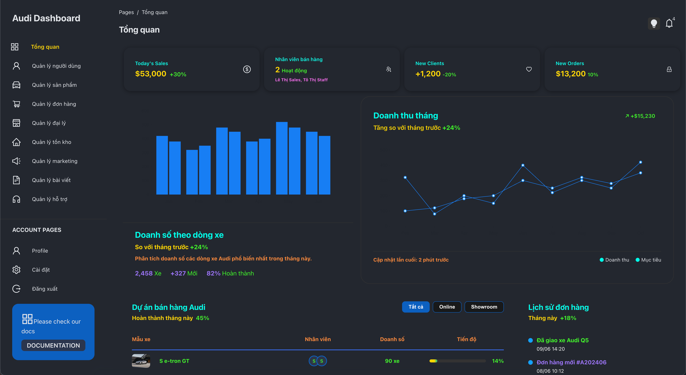
## 🌐 Live Demo & Deployment

### 🚀 Web Application
[🌍 Audi Showroom - audivn.web.app](https://audivn.web.app)

### ✨ Key Deployment Details
- **Platform**: Firebase Hosting
- **Domain**: audivn.web.app
- **Status**: Active and Fully Functional

## 👥 Developers
- Nguyennpcoder - Team Lead & Lead Developer
